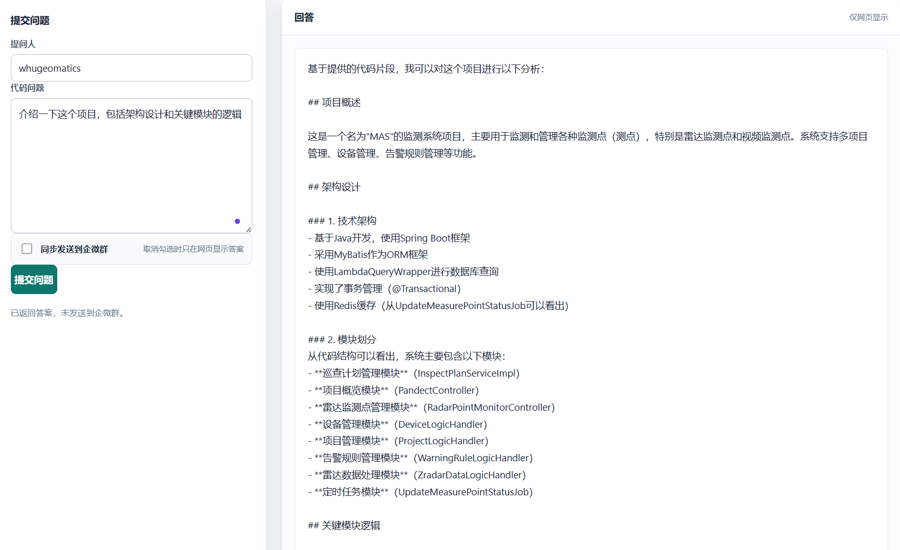

# codebot

`codebot` 是一个面向代码仓库的旁路问答服务，它会索引指定仓库的当前代码，用本地检索找出相关片段，再调用 OpenAI 兼容的大模型接口生成回答。

服务不修改目标代码仓库，适合部署成独立应用，给团队提供代码问答入口。

## 功能

- 索引本地代码仓库，记录当前分支、提交和代码片段。
- 可直接配置远程 Git 仓库 URL，由服务自动克隆和更新缓存。
- 提供网页提问入口，可选择把答案同步推送到企业微信群。
- 支持企业微信回调，群成员可以在企微信群里 `@机器人` 提问。
- 支持 OpenAI 兼容接口；未配置大模型时，会返回本地检索结果。
- 推送到企业微信群时使用群机器人 webhook。

## 两种企业微信接入方式

| 方式              | 需要企微管理员权限 | 用户入口                  | 回复方式                     | 适用场景         |
|-----------------|-----------|-----------------------|--------------------------|--------------|
| 本地网页提问 + 群机器人推送 | 否         | 浏览器页面或 `/web/ask` API | 群机器人 webhook 推送到群        | 先快速跑通、没有回调权限 |
| 企微机器人回调         | 是         | 企微群里 `@机器人 问题`        | 收到回调后异步调用群机器人 webhook 回复 | 需要完整群内交互     |

注意：企业微信群机器人 webhook 是单向能力，只能往群里发消息，不能读取群成员消息。要在群里直接 `@机器人` 提问，必须配置企业微信回调。

## 快速启动

### 1. 准备目标代码仓库

有两种方式：

- **本地仓库模式**：目标仓库已经在本机或服务器上存在，并切到要问答的分支。
- **远程仓库模式**：配置 GitHub、GitLab、Gitee 等远程 Git URL，`codebot` 会自动克隆到缓存目录并在重新索引时更新。

本地仓库模式检查：

```powershell
git -C D:\path\to\target-repository status
```

Linux / macOS:

```bash
git -C /path/to/target-repository status
```

远程仓库模式不需要提前下载代码，但运行环境必须能访问远程仓库并安装 `git`。私有仓库建议使用 SSH key 或 Git credential
helper，不建议把 token 直接写进 URL。

### 2. 配置环境变量

最少需要配置本地仓库路径或远程仓库 URL。配置大模型后会生成完整回答；不配置大模型时只返回本地检索结果。

本地仓库模式：

```powershell
$env:CODEBOT_REPOSITORY_PATH="D:\path\to\target-repository"
$env:CODEBOT_BRANCH="main"

$env:OPENAI_BASE_URL="https://api.openai.com/v1"
$env:OPENAI_API_KEY="sk-xxx"
$env:OPENAI_MODEL="gpt-4.1-mini"
$env:OPENAI_TIMEOUT="180s"
$env:OPENAI_MAX_TOKENS="1200"
```

Linux / macOS:

```bash
export CODEBOT_REPOSITORY_PATH="/path/to/target-repository"
export CODEBOT_BRANCH="main"

export OPENAI_BASE_URL="https://api.openai.com/v1"
export OPENAI_API_KEY="sk-xxx"
export OPENAI_MODEL="gpt-4.1-mini"
export OPENAI_TIMEOUT="180s"
export OPENAI_MAX_TOKENS="1200"
```

也可以复制示例配置文件，在项目根目录创建的 `application-local.yml`：

```powershell
Copy-Item .\application-local.example.yml .\application-local.yml
```

Linux / macOS:

```bash
cp application-local.example.yml application-local.yml
```

启动时显式加载：

```powershell
java -jar target\codebot-1.0.0-SNAPSHOT.jar --spring.config.additional-location=file:./application-local.yml
```

Linux / macOS:

```bash
java -jar target/codebot-1.0.0-SNAPSHOT.jar --spring.config.additional-location=file:./application-local.yml
```

远程仓库模式：

```powershell
$env:CODEBOT_REPOSITORY_URL="https://github.com/your-org/your-repo.git"
$env:CODEBOT_REPOSITORY_CACHE_PATH=".codebot/repositories"
$env:CODEBOT_BRANCH="main"
$env:CODEBOT_ADMIN_TOKEN="change-me"
```

Linux / macOS:

```bash
export CODEBOT_REPOSITORY_URL="https://github.com/your-org/your-repo.git"
export CODEBOT_REPOSITORY_CACHE_PATH=".codebot/repositories"
export CODEBOT_BRANCH="main"
export CODEBOT_ADMIN_TOKEN="change-me"
```

配置了 `CODEBOT_REPOSITORY_URL` 时，`CODEBOT_REPOSITORY_PATH` 会被忽略。缓存目录默认是 `.codebot/repositories`。

分支规则是明确的：

- 配置了 `CODEBOT_BRANCH` 时，首次索引会执行 `git clone --branch <CODEBOT_BRANCH> <CODEBOT_REPOSITORY_URL>`，然后只索引该分支代码。
- 已有缓存仓库时，重新索引会先执行 `git fetch --all --prune`，再基于 `origin/<CODEBOT_BRANCH>` 切换本地缓存分支，然后只索引该分支代码。
- 没有配置 `CODEBOT_BRANCH` 时，使用默认值 `main`。

如果需要把网页提问答案推送到企微群，再配置群机器人 webhook：

```powershell
$env:WECOM_ROBOT_WEBHOOK_URL="https://qyapi.weixin.qq.com/cgi-bin/webhook/send?key=xxx"
```

Linux / macOS:

```bash
export WECOM_ROBOT_WEBHOOK_URL="https://qyapi.weixin.qq.com/cgi-bin/webhook/send?key=xxx"
```

### 3. 启动服务

源码启动：

```powershell
mvn spring-boot:run
```

Linux / macOS:

```bash
mvn spring-boot:run
```

或先打包再运行：

```powershell
mvn -DskipTests package
java -jar target\codebot-1.0.0-SNAPSHOT.jar
```

Linux / macOS:

```bash
mvn -DskipTests package
java -jar target/codebot-1.0.0-SNAPSHOT.jar
```

默认端口是 `18080`。

### 4. 检查索引状态

```powershell
curl http://127.0.0.1:18080/api/v1/code-bot/health
```

Linux / macOS:

```bash
curl http://127.0.0.1:18080/api/v1/code-bot/health
```

返回中会包含：

- `branch`：当前索引分支
- `commitId`：当前索引提交
- `chunks`：代码片段数量
- `lastError`：索引未就绪时的错误原因

如果本地仓库不存在，服务仍会启动，但 `status` 会显示 `NOT_READY`。请先检查 `CODEBOT_REPOSITORY_PATH`。如果使用远程仓库模式，请检查
`CODEBOT_REPOSITORY_URL`、网络、分支名和 Git 凭据。

## 接入方式一：网页提问 + 企微群推送

这个方式不需要企业微信管理员权限，只需要能在目标群里添加群机器人并拿到 webhook。

流程：

```text
成员打开网页提问
  -> codebot 检索目标代码仓库
  -> 调用大模型生成答案
  -> 可选：通过群机器人 webhook 推送答案到企微群
```

操作步骤：

1. 在企业微信群里添加群机器人，复制 webhook。
2. 配置 `WECOM_ROBOT_WEBHOOK_URL` 或 `codebot.wecom.webhook-url`。
3. 启动 `codebot`。
4. 打开 `http://127.0.0.1:18080/`。
5. 输入提问人和问题。
6. 勾选“同步发送答案到企微群”后提交。

也可以直接调用 API：

```powershell
curl -X POST http://127.0.0.1:18080/api/v1/code-bot/web/ask `
  -H "Content-Type: application/json" `
  -d "{\"askedBy\":\"张三\",\"question\":\"用户登录逻辑在哪里实现？\",\"sendToGroup\":true}"
```

Linux / macOS:

```bash
curl -X POST http://127.0.0.1:18080/api/v1/code-bot/web/ask \
  -H "Content-Type: application/json" \
  -d '{"askedBy":"张三","question":"用户登录逻辑在哪里实现？","sendToGroup":true}'
```

`sendToGroup` 为 `true` 时，会调用企微群机器人 webhook；为 `false` 时只返回 HTTP 响应。

## 接入方式二：企微机器人回调

这个方式需要企业微信后台权限，用于实现群里直接 `@机器人` 提问。

企微后台需要配置：

```text
URL: https://你的域名/api/v1/code-bot/wecom/callback
Token: 与 codebot.wecom.token 一致
EncodingAESKey: 与 codebot.wecom.encoding-aes-key 一致
```

服务提供两个回调接口：

```text
GET  /api/v1/code-bot/wecom/callback   企业微信 URL 验证
POST /api/v1/code-bot/wecom/callback   接收企业微信加密消息
```

回调收到文本消息后，服务会：

1. 校验签名并解密消息。
2. 去掉内容里的 `@xxx` 前缀。
3. 基于剩余文本执行代码问答。
4. 异步通过 `codebot.wecom.webhook-url` 把答案发回群。

因此，回调模式也建议配置群机器人 webhook，否则服务能接收问题，但不会把答案发到群里。

回调配置示例：

```yaml
codebot:
  wecom:
    token: 企微回调Token
    encoding-aes-key: 企微回调EncodingAESKey
    receive-id: 企业IDcorpId或留空
    strict-receive-id: false
    webhook-url: https://qyapi.weixin.qq.com/cgi-bin/webhook/send?key=xxx
```

更多企业微信配置步骤见 [docs/wecom-setup.md](docs/wecom-setup.md)。

## 大模型配置

`codebot` 调用 OpenAI 兼容的 `/chat/completions` 接口。

```yaml
codebot:
  llm:
    base-url: https://api.openai.com/v1
    api-key: sk-xxx
    model: gpt-4.1-mini
    timeout: 180s
    max-tokens: 1200
    thinking-type:
```

环境变量写法：

```powershell
$env:OPENAI_BASE_URL="https://api.openai.com/v1"
$env:OPENAI_API_KEY="sk-xxx"
$env:OPENAI_MODEL="gpt-4.1-mini"
$env:OPENAI_TIMEOUT="180s"
$env:OPENAI_MAX_TOKENS="1200"
$env:OPENAI_THINKING_TYPE=""
```

Linux / macOS:

```bash
export OPENAI_BASE_URL="https://api.openai.com/v1"
export OPENAI_API_KEY="sk-xxx"
export OPENAI_MODEL="gpt-4.1-mini"
export OPENAI_TIMEOUT="180s"
export OPENAI_MAX_TOKENS="1200"
export OPENAI_THINKING_TYPE=""
```

接入 GLM / 智谱等兼容网关时，把 `base-url` 配到网关的 OpenAI 兼容路径，例如：

```powershell
$env:OPENAI_BASE_URL="https://open.bigmodel.cn/api/paas/v4"
$env:OPENAI_MODEL="glm-4.5-air"
$env:OPENAI_THINKING_TYPE="disabled"
```

Linux / macOS:

```bash
export OPENAI_BASE_URL="https://open.bigmodel.cn/api/paas/v4"
export OPENAI_MODEL="glm-4.5-air"
export OPENAI_THINKING_TYPE="disabled"
```

如果模型网关不支持 `thinking` 参数，请把 `OPENAI_THINKING_TYPE` 设为空。

## 配置项

| 配置项                               | 环境变量                            | 说明                                    |
|-----------------------------------|---------------------------------|---------------------------------------|
| `codebot.repository-path`         | `CODEBOT_REPOSITORY_PATH`       | 要索引的本地代码仓库路径                          |
| `codebot.repository-url`          | `CODEBOT_REPOSITORY_URL`        | 远程 Git 仓库 URL；配置后自动克隆/更新缓存，并优先于本地路径   |
| `codebot.repository-cache-path`   | `CODEBOT_REPOSITORY_CACHE_PATH` | 远程仓库本地缓存目录，默认 `.codebot/repositories` |
| `codebot.branch`                  | `CODEBOT_BRANCH`                | 要索引的分支；远程仓库模式会拉取该分支，默认 `main`          |
| `codebot.admin-token`             | `CODEBOT_ADMIN_TOKEN`           | 可选管理 token；配置后保护 `/admin/reindex` 和 `/debug/ask` |
| `codebot.wecom.webhook-url`       | `WECOM_ROBOT_WEBHOOK_URL`       | 企业微信群机器人 webhook，用于推送答案               |
| `codebot.wecom.token`             | `WECOM_CALLBACK_TOKEN`          | 企业微信回调 Token                          |
| `codebot.wecom.encoding-aes-key`  | `WECOM_ENCODING_AES_KEY`        | 企业微信回调 EncodingAESKey，长度 43 位         |
| `codebot.wecom.receive-id`        | `WECOM_RECEIVE_ID`              | 企业 ID corpId，可按企微回调类型配置               |
| `codebot.wecom.strict-receive-id` | 无                               | 是否严格校验 receive-id                     |
| `codebot.llm.base-url`            | `OPENAI_BASE_URL`               | OpenAI 兼容接口地址，不包含 `/chat/completions` |
| `codebot.llm.api-key`             | `OPENAI_API_KEY`                | 大模型 API key                           |
| `codebot.llm.model`               | `OPENAI_MODEL`                  | 模型名称                                  |
| `codebot.llm.timeout`             | `OPENAI_TIMEOUT`                | 大模型请求超时                               |
| `codebot.llm.max-tokens`          | `OPENAI_MAX_TOKENS`             | 最大输出 token 数                          |
| `codebot.llm.thinking-type`       | `OPENAI_THINKING_TYPE`          | 可选 thinking 参数                        |

## API

### 健康检查

```powershell
curl http://127.0.0.1:18080/api/v1/code-bot/health
```

Linux / macOS:

```bash
curl http://127.0.0.1:18080/api/v1/code-bot/health
```

### 重新索引

目标仓库拉代码、切分支或切 commit 后，需要重新索引。远程仓库模式下，重新索引会先更新缓存仓库：

```powershell
curl -X POST http://127.0.0.1:18080/api/v1/code-bot/admin/reindex
```

Linux / macOS:

```bash
curl -X POST http://127.0.0.1:18080/api/v1/code-bot/admin/reindex
```

如果配置了 `CODEBOT_ADMIN_TOKEN`，需要带上请求头：

```powershell
curl -X POST http://127.0.0.1:18080/api/v1/code-bot/admin/reindex `
  -H "X-CodeBot-Admin-Token: change-me"
```

Linux / macOS:

```bash
curl -X POST http://127.0.0.1:18080/api/v1/code-bot/admin/reindex \
  -H "X-CodeBot-Admin-Token: change-me"
```

### 本地调试问答

```powershell
curl "http://127.0.0.1:18080/api/v1/code-bot/debug/ask?question=用户登录逻辑在哪里实现"
```

Linux / macOS:

```bash
curl "http://127.0.0.1:18080/api/v1/code-bot/debug/ask?question=用户登录逻辑在哪里实现"
```

如果配置了 `CODEBOT_ADMIN_TOKEN`，`/debug/ask` 同样需要 `X-CodeBot-Admin-Token` 请求头。

### 网页问答 API

```powershell
curl -X POST http://127.0.0.1:18080/api/v1/code-bot/web/ask `
  -H "Content-Type: application/json" `
  -d "{\"askedBy\":\"张三\",\"question\":\"用户登录逻辑在哪里实现？\",\"sendToGroup\":false}"
```

Linux / macOS:

```bash
curl -X POST http://127.0.0.1:18080/api/v1/code-bot/web/ask \
  -H "Content-Type: application/json" \
  -d '{"askedBy":"张三","question":"用户登录逻辑在哪里实现？","sendToGroup":false}'
```

## 索引范围

默认索引文件类型：

- `.java`
- `.xml`
- `.yml`
- `.yaml`
- `.properties`
- `.md`
- `.sql`
- `.txt`
- `pom.xml`

默认排除目录：

- `.git`
- `.idea`
- `target`
- `logs`
- `node_modules`

包含 `password`、`secret`、`token`、`webhook`、`api-key`、`access_token` 等关键词的行会在送入模型前替换成
`[REDACTED SENSITIVE CONFIG LINE]`。

## 使用案例



## 常见问题

### 只配置群机器人 webhook，为什么不能在群里 @机器人？

群机器人 webhook 只能让外部系统往群里发消息，不能读取群消息。要读取群成员发出的 `@机器人` 问题，必须配置企业微信回调。

### 网页有答案，但企微群没有消息

检查：

- 是否配置了 `codebot.wecom.webhook-url` 或 `WECOM_ROBOT_WEBHOOK_URL`。
- 群机器人是否仍在目标群。
- 网页是否勾选“同步发送答案到企微群”。
- 服务日志是否有 `WeCom robot send failed`。

### 群里 @机器人 后没有回答

检查：

- 企业微信回调 URL 是否能被公网访问。
- `Token` 和 `EncodingAESKey` 是否与服务配置一致。
- `EncodingAESKey` 是否为 43 位。
- 是否配置了群机器人 webhook 用于发送答案。
- 服务日志是否收到 `Received WeCom message`。

### 回答只返回文件列表

说明没有配置可用的大模型接口。配置 `codebot.llm.api-key`、`codebot.llm.base-url` 和 `codebot.llm.model` 后重启服务。

### 回答引用的代码不是最新

先确认目标仓库已经切到正确分支并拉到最新代码，然后调用：

```powershell
curl -X POST http://127.0.0.1:18080/api/v1/code-bot/admin/reindex
```

Linux / macOS:

```bash
curl -X POST http://127.0.0.1:18080/api/v1/code-bot/admin/reindex
```

## 部署建议

- 用 Nginx 或网关把公网 HTTPS 域名转发到服务端口，回调模式必须保证企微后台能访问。
- 不要把 `application-local.yml`、API key、webhook、Token 提交到 Git。
- 生产环境建议配置 `CODEBOT_ADMIN_TOKEN`，避免公网访问者触发重新索引或 debug 问答。
- 生产环境建议全部用环境变量或密钥管理系统注入敏感配置。
- 多人高频使用时，建议把 `codebot` 和目标代码仓库所在服务隔离部署。
